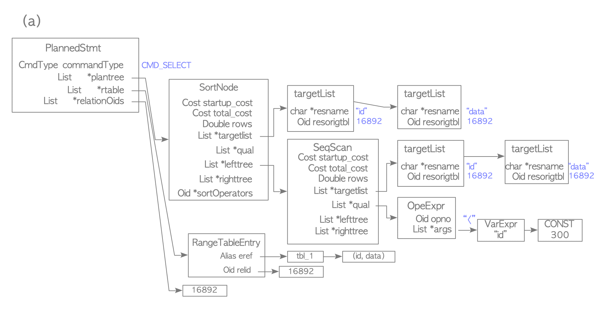

3장에서는 client가 요청한 query를 PostgreSQL의 backend process가 어떻게 처리하는지에 대해 소개합니다. Query processing에 필요한 component들이 각각 어떤 역할을 수행하는지 처리 순서대로 소개하며, 특히 Planner와 Executor의 동작 방식에 대해 조금 더 자세히 살펴보겠습니다.

---
## 3.0. TL;DR 🤷 
3장 내용 요약!
- PostgreSQL의 backend process는 5개의 component로 나뉘어져 query를 처리한다.
  - Parser: SQL문의 syntax 검증 및 parser tree 생성 역할
  - Analyzer: SQL문의 semantic 검증 및 query tree 생성 역할
  - Rewriter: User-defined rule을 조회하여 query tree 재생성 역할
  - Planner: Cost-based optimization을 통해 실행 계획 생성 역할
  - Executor: 실행 계획에 따라 operation algorithm 실행 역할

## 3.1. Overview 🗺️
PostgreSQL은 parallel query를 제외한 모든 query를 backend process에서 처리합니다. Backend process는 아래 component로 나눠집니다.
- Parser: 평문으로 되어 있는 SQL statement의 syntax를 검증하고, 다음 단계에서 처리 가능한 형태의 자료구조인 parser tree를 생성하는 역할을 맡습니다.
- Analyzer: Parser tree를 통해 query의 semantic을 검증하고, 다음 단계에서 처리 가능한 형태의 자료구조인 query tree를 생성하는 역할을 맡습니다. 
- Rewriter: Query tree를 정해진 rule을 통해 변형하는 역할을 맡습니다. View를 조회하는 subtree를 inlining 한다던지 또는 불필요하거나 중복적인 expression을 제거하여 tree를 간소화 하는 일을 해당 단계에서 진행합니다.
- Planner: Query tree에서 요구하는 data 가공을 제일 효율적으로 수행할 수 있는 operation들의 조합을 찾아 plan tree로 생성하는 역할을 맡습니다.
- Executor: Plan tree의 각 plan node에 대응되는 operation을 수행하는 역할을 맡습니다.

### 3.1.1 Parser
Parser는 평문으로 되어 있는 SQL statement의 syntax check를 하고 parse tree를 생성하는 일을 맡고 있습니다. 여기서 syntax check란 SQL 문법에 알맞게 query가 작성되었는지를 검증하는 것을 뜻합니다. 예를 들어 SELECT, FROM, WHERE 절이 적절한 위치에 쓰여졌는지, 또는 projection 할 column list에 쉼표를 잘 넣었는지 등을 확인합니다. Column과 table의 이름이 알맞게 쓰여졌는지는 syntax check 단계에서 하지 않고 semantic check 단계에서 진행되며, 해당 책임은 analyzer module에 있습니다. 

Parser tree는 평문 SQL의 요소를 논리적으로 구분하여 저장한 자료구조입니다. 다만 하나의 구조체로 표현되는 것은 아니고 statement의 형태 마다 대응되는 구조체가 있으며, 그것들의 집합을 parser tree라고 부릅니다. 예를 들어 <a href="https://github.com/postgres/postgres/blob/master/src/include/nodes/parsenodes.h">parsenodes.h</a> 에 정의된 *Stmt 구조체들이 parser tree라는 카테고리를 구성하는 요소라고 할 수 있습니다.  

<details>
<summary>Statement 구조체 보기</summary>

```c
typedef struct InsertStmt
{
  NodeTag    type;
  RangeVar   *relation;      /* relation to insert into */
  List       *cols;          /* optional: names of the target columns */
  Node       *selectStmt;    /* the source SELECT/VALUES, or NULL */
  OnConflictClause *onConflictClause; /* ON CONFLICT clause */
  List       *returningList; /* list of expressions to return */
  WithClause *withClause;    /* WITH clause */
  OverridingKind override;   /* OVERRIDING clause */
} InsertStmt;

typedef struct DeleteStmt
{
  NodeTag    type;
  RangeVar   *relation;      /* relation to delete from */
  List	     *usingClause;   /* optional using clause for more tables */
  Node	     *whereClause;   /* qualifications */
  List	     *returningList; /* list of expressions to return */
  WithClause *withClause;    /* WITH clause */
} DeleteStmt;

typedef struct UpdateStmt
{
  NodeTag    type;
  RangeVar   *relation;      /* relation to update */
  List	     *targetList;    /* the target list (of ResTarget) */
  Node	     *whereClause;   /* qualifications */
  List	     *fromClause;    /* optional from clause for more tables */
  List	     *returningList; /* list of expressions to return */
  WithClause *withClause;    /* WITH clause */
} UpdateStmt;

typedef struct MergeStmt
{
  NodeTag    type;
  RangeVar   *relation;         /* target relation to merge into */
  Node	     *sourceRelation;   /* source relation */
  Node	     *joinCondition;    /* join condition between source and target */
  List	     *mergeWhenClauses; /* list of MergeWhenClause(es) */
  WithClause *withClause;       /* WITH clause */
} MergeStmt;

typedef struct SelectStmt
{
  NodeTag    type;

  /*
    * These fields are used only in "leaf" SelectStmts.
    */
  List       *distinctClause; /* NULL, list of DISTINCT ON exprs, or
                                * lcons(NIL,NIL) for all (SELECT DISTINCT) */
  IntoClause *intoClause;     /* target for SELECT INTO */
  List       *targetList;     /* the target list (of ResTarget) */
  List       *fromClause;     /* the FROM clause */
  Node       *whereClause;    /* WHERE qualification */
  List       *groupClause;    /* GROUP BY clauses */
  bool        groupDistinct;  /* Is this GROUP BY DISTINCT? */
  Node       *havingClause;   /* HAVING conditional-expression */
  List       *windowClause;   /* WINDOW window_name AS (...), ... */

  /*
    * In a "leaf" node representing a VALUES list, the above fields are all
    * null, and instead this field is set.  Note that the elements of the
    * sublists are just expressions, without ResTarget decoration. Also note
    * that a list element can be DEFAULT (represented as a SetToDefault
    * node), regardless of the context of the VALUES list. It's up to parse
    * analysis to reject that where not valid.
    */
  List       *valuesLists;    /* untransformed list of expression lists */

  /*
    * These fields are used in both "leaf" SelectStmts and upper-level
    * SelectStmts.
  */
  List       *sortClause;     /* sort clause (a list of SortBy's) */
  Node       *limitOffset;    /* # of result tuples to skip */
  Node       *limitCount;     /* # of result tuples to return */
  LimitOption limitOption;    /* limit type */
  List       *lockingClause;  /* FOR UPDATE (list of LockingClause's) */
  WithClause *withClause;     /* WITH clause */

  /*
    * These fields are used only in upper-level SelectStmts.
    */
  SetOperation op;          /* type of set op */
  bool         all;         /* ALL specified? */
  struct SelectStmt *larg;  /* left child */
  struct SelectStmt *rarg;  /* right child */
  /* Eventually add fields for CORRESPONDING spec here */
} SelectStmt;
```
</details>

<br/>

간단한 예시를 통해 SelectStmt가 어떻게 구성되는지 확인해보겠습니다. 아래 예시와 같은 SQL이 주어졌다고 가정해봅시다.
```sql
testdb=# SELECT id, data FROM tbl_a WHERE id < 300 ORDER BY data;
```
이때 SelectStmt는 아래와 같이 생성됩니다.
<figure>
  
  <figcaption style="text-align: center">Fig 3.1 - Parser tree example</figcaption>
</figure>

Select list에 있는 id, data column들이 targetList에 담기게 됩니다. fromClause에는 tbl_a table이 담기고, whereClause에는 id < 300 조건문이 expression tree로 담기게 됩니다. 마지막으로 query의 ORDER BY 문이 sortClause에 담기는 것을 확인할 수 있습니다.

### 3.1.2 Analyzer
Parser가 SQL statement의 syntax check를 했다면 analyzer는 semantic check를 담당합니다. Semantic check란 SQL statement에 포함된 table, functions, 또는 연산자들을 system catalogs를 이용해 유효성 여부를 검사하는 것을 뜻합니다. Parser 단계에서는 system catalog lookup이 발생하지 않지만 analyzer 단계에서는 유효성 검사를 위한 lookup이 발생하게 됩니다.

Semantic check를 진행하면서 만들어지는 결과물은 query tree라는 자료구조로 만들어집니다. Query tree의 root에는 Query라는 구조체가 위치해 있으며 해당 구조체에는 parser tree의 각 요소들에 대한 metadata를 저장할 수 있도록 구성되어 있습니다. Query는 Stmt 구조체들과 같이 <a href="https://github.com/postgres/postgres/blob/master/src/include/nodes/parsenodes.h">parsenodes.h</a>에 위치해 있습니다.  

<details>
<summary>Query 구조체 보기</summary>

```c
/*
 * Query -
 *	  Parse analysis turns all statements into a Query tree
 *	  for further processing by the rewriter and planner.
 *
 *	  Utility statements (i.e. non-optimizable statements) have the
 *	  utilityStmt field set, and the rest of the Query is mostly dummy.
 *
 *	  Planning converts a Query tree into a Plan tree headed by a PlannedStmt
 *	  node --- the Query structure is not used by the executor.
 */
typedef struct Query
{
	NodeTag		type;

	CmdType		commandType;	/* select|insert|update|delete|merge|utility */

	QuerySource querySource;	/* where did I come from? */

	uint64		queryId;		/* query identifier (can be set by plugins) */

	bool		canSetTag;		/* do I set the command result tag? */

	Node	   *utilityStmt;	/* non-null if commandType == CMD_UTILITY */

	int			resultRelation; /* rtable index of target relation for
								 * INSERT/UPDATE/DELETE/MERGE; 0 for SELECT */

	bool		hasAggs;		/* has aggregates in tlist or havingQual */
	bool		hasWindowFuncs; /* has window functions in tlist */
	bool		hasTargetSRFs;	/* has set-returning functions in tlist */
	bool		hasSubLinks;	/* has subquery SubLink */
	bool		hasDistinctOn;	/* distinctClause is from DISTINCT ON */
	bool		hasRecursive;	/* WITH RECURSIVE was specified */
	bool		hasModifyingCTE;	/* has INSERT/UPDATE/DELETE in WITH */
	bool		hasForUpdate;	/* FOR [KEY] UPDATE/SHARE was specified */
	bool		hasRowSecurity; /* rewriter has applied some RLS policy */

	bool		isReturn;		/* is a RETURN statement */

	List	   *cteList;		/* WITH list (of CommonTableExpr's) */

	List	   *rtable;			/* list of range table entries */
	FromExpr   *jointree;		/* table join tree (FROM and WHERE clauses);
								 * also USING clause for MERGE */

	List	   *mergeActionList;	/* list of actions for MERGE (only) */
	bool		mergeUseOuterJoin;	/* whether to use outer join */

	List	   *targetList;		/* target list (of TargetEntry) */

	OverridingKind override;	/* OVERRIDING clause */

	OnConflictExpr *onConflict; /* ON CONFLICT DO [NOTHING | UPDATE] */

	List	   *returningList;	/* return-values list (of TargetEntry) */

	List	   *groupClause;	/* a list of SortGroupClause's */
	bool		groupDistinct;	/* is the group by clause distinct? */

	List	   *groupingSets;	/* a list of GroupingSet's if present */

	Node	   *havingQual;		/* qualifications applied to groups */

	List	   *windowClause;	/* a list of WindowClause's */

	List	   *distinctClause; /* a list of SortGroupClause's */

	List	   *sortClause;		/* a list of SortGroupClause's */

	Node	   *limitOffset;	/* # of result tuples to skip (int8 expr) */
	Node	   *limitCount;		/* # of result tuples to return (int8 expr) */
	LimitOption limitOption;	/* limit type */

	List	   *rowMarks;		/* a list of RowMarkClause's */

	Node	   *setOperations;	/* set-operation tree if this is top level of
								 * a UNION/INTERSECT/EXCEPT query */

	List	   *constraintDeps; /* a list of pg_constraint OIDs that the query
								 * depends on to be semantically valid */

	List	   *withCheckOptions;	/* a list of WithCheckOption's (added
									 * during rewrite) */

	/*
	 * The following two fields identify the portion of the source text string
	 * containing this query.  They are typically only populated in top-level
	 * Queries, not in sub-queries.  When not set, they might both be zero, or
	 * both be -1 meaning "unknown".
	 */
	int			stmt_location;	/* start location, or -1 if unknown */
	int			stmt_len;		/* length in bytes; 0 means "rest of string" */
} Query;
```
</details>

<br/>

Fig 3.1의 parser tree는 아래와 같은 query tree로 생성이 됩니다.
<figure>
  
  <figcaption style="text-align: center">Fig 3.2 - Query tree example</figcaption>
</figure>

### 3.1.3 Rewriter
Analyzer에서 생성된 query tree는 Planner에게 전달되기 전에 Rewriter module을 거쳐가게 됩니다. Rewriter는 사용자가 <a href="https://www.postgresql.org/docs/current/rules.html">rule system</a>에 저장한 규칙을 사용하여 전달받은 query tree를 변형시키는 일을 담당합니다. Rule system에 대한 이야기는 이번 장에 하기에는 내용이 너무 길어지므로 다음 기회에 자세히 다루도록 하겠습니다. 

Rewriter의 역할을 이해하기 좋은 예제로는 view가 있습니다. PostgreSQL은 view를 rule system을 사용하여 구현했습니다. CREATE VIEW command를 사용하여 view를 정의하면 해당 view에 대한 query tree를 pg_rewrite system catalog에 저장합니다. 그 후 생성한 view를 조회하는 query가 들어왔을 경우 Rewriter는 pg_rewrite를 조회하여 해당 view에 대한 rule을 가져와 query tree를 수정하여 Planner에게 전달하게 됩니다.

아래 예제를 통해 생성한 view가 pg_rewrite에 어떻게 저장되는지 확인해봅시다.

```sql
postgres=# create table hypersql (c1 int);
CREATE TABLE
postgres=# create view hypersql_view as select * from hypersql where c1 > 100;
CREATE VIEW
postgres=# select a.ev_action from pg_rewrite a, pg_class b where a.ev_class = b.oid and b.relname = 'hypersql_view';
```

<details>
<summary>조회결과 보기</summary>

```sql
({QUERY :commandType 1 
        :querySource 0 
        :canSetTag true 
        :utilityStmt <> 
        :resultRelation 0 
        :hasAggs false 
        :hasWindowFuncs false 
        :hasTargetSRFs false 
        :hasSubLinks false 
        :hasDistinctOn false 
        :hasRecursive false 
        :hasModifyingCTE false 
        :hasForUpdate false 
        :hasRowSecurity false 
        :isReturn false 
        :cteList <> 
        :rtable ({RTE :alias {ALIAS :aliasname old :colnames <>} 
                      :eref {ALIAS :aliasname old :colnames ("c1")} 
                      :rtekind 0 
                      :relid 16470 
                      :relkind v 
                      :rellockmode 1 
                      :tablesample <> 
                      :lateral false 
                      :inh false 
                      :inFromCl false 
                      :requiredPerms 0 
                      :checkAsUser 0 
                      :selectedCols (b) 
                      :insertedCols (b) 
                      :updatedCols (b) 
                      :extraUpdatedCols (b) 
                      :securityQuals <>
                  } 
                  {RTE :alias {ALIAS :aliasname new :colnames <>} 
                      :eref {ALIAS :aliasname new :colnames ("c1")} 
                      :rtekind 0 
                      :relid 16470 
                      :relkind v 
                      :rellockmode 1 
                      :tablesample <> 
                      :lateral false 
                      :inh false 
                      :inFromCl false 
                      :requiredPerms 0 
                      :checkAsUser 0 
                      :selectedCols (b) 
                      :insertedCols (b) 
                      :updatedCols (b) 
                      :extraUpdatedCols (b) 
                      :securityQuals <>
                  }
                  {RTE :alias <> 
                      :eref {ALIAS :aliasname hypersql :colnames ("c1")} 
                      :rtekind 0 
                      :relid 16467 
                      :relkind r 
                      :rellockmode 1 
                      :tablesample <> 
                      :lateral false 
                      :inh true 
                      :inFromCl true 
                      :requiredPerms 2 
                      :checkAsUser 0 
                      :selectedCols (b 8) 
                      :insertedCols (b) 
                      :updatedCols (b) 
                      :extraUpdatedCols (b) 
                      :securityQuals <>
                  }) 
        :jointree {FROMEXPR :fromlist ({RANGETBLREF :rtindex 3}) 
                            :quals {OPEXPR :opno 521 
                                          :opfuncid 147 
                                          :opresulttype 16 
                                          :opretset false 
                                          :opcollid 0 
                                          :inputcollid 0 
                                          :args ({VAR :varno 3 
                                                      :varattno 1 
                                                      :vartype 23 
                                                      :vartypmod -1 
                                                      :varcollid 0 
                                                      :varlevelsup 0 
                                                      :varnosyn 3 
                                                      :varattnosyn 1 
                                                      :location 58
                                                  } 
                                                  {CONST :consttype 23 
                                                        :consttypmod -1 
                                                        :constcollid 0 
                                                        :constlen 4 
                                                        :constbyval true 
                                                        :constisnull false 
                                                        :location 63 
                                                        :constvalue 4 [ 100 0 0 0 0 0 0 0 ]
                                                  }) 
                                            :location 61
                                    }
                    } 
        :targetList ({TARGETENTRY :expr {VAR :varno 3 
                                            :varattno 1 
                                            :vartype 23 
                                            :vartypmod -1 
                                            :varcollid 0 
                                            :varlevelsup 0 
                                            :varnosyn 3 
                                            :varattnosyn 1 
                                            :location 36
                                        } 
                                  :resno 1 
                                  :resname c1 
                                  :ressortgroupref 0 
                                  :resorigtbl 16467 
                                  :resorigcol 1 
                                  :resjunk false
                      }) 
        :override 0 
        :onConflict <> 
        :returningList <> 
        :groupClause <> 
        :groupDistinct false 
        :groupingSets <> 
        :havingQual <> 
        :windowClause <> 
        :distinctClause <> 
        :sortClause <> 
        :limitOffset <> 
        :limitCount <> 
        :limitOption 0 
        :rowMarks <> 
        :setOperations <> 
        :constraintDeps <> 
        :withCheckOptions <> 
        :stmt_location 0 
        :stmt_len 66
})
```
</details>
<br/>

위처럼 저장된 query tree는 아래 그림처럼 view에 대한 조회가 발생했을 때 view의 alias 대신 append가 되는 방식으로 동작하게 됩니다.

<figure>
  
  <figcaption style="text-align: center">Fig 3.3 - Rewriter example</figcaption>
</figure>

### 3.1.4 Planner and Executor
Rewriter의 손을 거친 query tree는 최종적으로 Planner에게 전달됩니다. Planner에 도달하기까지 지나온 module의 역할은 SQL statement가 요구하는 data에 대한 명세서를 만드는 것이라면, Planner의 역할은 이 명세서에서 요구하는 data를 가공하기 위한 실행 계획 즉, plan tree를 만드는 것입니다. 

SQL statement가 요구하는 결과물을 생성하는 것은 다양한 조합의 계획을 통해 수행될 수 있습니다. 이 때 Planner는 가능한 실행 계획들 중에 제일 효율적인 계획을 선택해야 하는데, PostgreSQL에서는 그것을 cost-based optimization을 통해 달성합니다. PostgreSQL은 rule-based optimization나 optimizer hint를 지원하지 않고 순수히 CBO를 통해서만 plan tree를 생성하는데, 만약 Oracle을 사용할 때처럼 hint를 사용하고 싶다면 <a href="http://pghintplan.osdn.jp/pg_hint_plan.html">pg_hint</a> extension을 사용해야 합니다. Planner의 CBO와 plan tree generation 기법은 아래 section에서 좀 더 자세히 다루도록 하겠습니다.

Planner가 plan tree를 생성하면 Executor는 plan tree에 저장된 실행 계획에 따라 data 가공에 필요한 algorithm을 실행 시키게 됩니다. Plan tree는 plan node 라고 하는 encapsulation unit으로 이루어져 있는데, Executor는 plan tree의 leaf node부터 root node까지 아래에서 위 순서로 plan node에 대응되는 algorithm을 실행 시켜 사용자가 요구한 data를 가공하게 됩니다. Executor의 algorithm은 전부 소개할 수는 없지만 join에 사용되는 algorithm을 아래 section에서 좀 더 자세히 다루도록 하겠습니다.

## 3.2. Cost-based Optimization 🪙
앞서 말씀드린 바와 같이 PostgreSQL의 query optimization은 cost-based로 수행됩니다. 여기서 cost란 query processing에 필요한 여러 resource를 숫자로 표현한 것을 말하는데, 그렇기 때문에 cost는 절대적 성능 지표라고 하기 보다는 비교를 쉽게 하기 위한 상대적 성능 지표로 볼 수 있습니다. 

Cost는 각 executor operation 별로 정의된 함수에 의해 계산되고, 각 operation이 필요로 하는 resource와 tuple 개수 또는 page 개수와 같은 상황 별 지표를 토대로 값이 정해집니다. 각 operation 별 cost 함수는 <a href="https://github.com/postgres/postgres/blob/master/src/backend/optimizer/path/costsize.c">costsize.c</a>에 정의되어 있습니다. 예를 들어 sequential scan과 index scan의 cost는 각각 cost_seqscan(), cost_index() 함수를 사용하여 계산합니다.

계산된 cost는 EXPLAIN command를 사용하여 출력해볼 수 있습니다. Cost는 start-up cost와 run cost 두 단계로 표현되고 정의는 아래와 같습니다.
- start-up cost: 한 tuple을 fetch 해오기까지 소요되는 cost. 예를 들어 index scan의 start-up cost는 index leaf block에 있는 tuple에 도달하기 까지 읽어야 하는 index block read cost입니다.
- run cost: 모든 tuple을 fetch 해오기까지 소요되는 cost.

Query에 대해 EXPLAIN을 출력해보면 start-up cost와 run cost를 확인해볼 수 있습니다. 간단한 예제를 통해 확인해보겠습니다.

```sql
1 postgres=# create table test (c1 int, c2 int);
2 CREATE TABLE
3 postgres=# insert into test select generate_series(1,10000), generate_series(1,10000);
4 INSERT 0 10000
5 postgres=# EXPLAIN SELECT * FROM test;
6                         QUERY PLAN                        
7 ----------------------------------------------------------
8  Seq Scan on test  (cost=0.00..145.00 rows=10000 width=8)
9 (1 row)
```

위 예제를 보면 8번 줄에 cost가 적혀있는 것을 볼 수 있습니다. 첫 번째 값이 start-up cost이고 두 번째 값은 start-up cost와 run cost를 합친 total cost입니다. 

아래 subsection에서는 sequential scan과 index scan operation의 cost estimation이 어떻게 계산되는지 살펴보겠습니다. 예제로 사용할 table은 아래 정의된 _hypersql_ table로 통일하겠습니다.

```sql
postgres=# create table hypersql (id int primary key, data int);
CREATE TABLE
postgres=# create index hypersql_idx on hypersql(data);
CREATE INDEX
postgres=# insert into hypersql select generate_series(1,10000), generate_series(1,10000);
INSERT 0 10000
postgres=# \d hypersql
              Table "public.hypersql"
 Column |  Type   | Collation | Nullable | Default 
--------+---------+-----------+----------+---------
 id     | integer |           | not null | 
 data   | integer |           |          | 
Indexes:
    "hypersql_pkey" PRIMARY KEY, btree (id)
    "hypersql_idx" btree (data)
```

### 3.2.1. Sequential Scan Cost Estimation
첫번째로 cost_seqscan() 함수로 계산되는 sequential scan의 cost estimation에 대해 알아보겠습니다. Sequential scan의 start-up cost는 항상 0으로 계산되고 run cost는 아래의 수식으로 정의됩니다.

$$
\begin{aligned}
\text{run cost without filter} &= \text{cpu\_tuple\_cost} \times N_{\text{tuple}} + \text{seq\_page\_cost} \times N_{\text{page}}
\newline
\text{run cost with filter} &= (\text{cpu\_tuple\_cost} + \text{cpu\_operator\_cost}) \times N_{\text{tuple}} 
\newline
                            &+ \text{seq\_page\_cost} \times N_{\text{page}}
\end{aligned}
$$

위 식에 포함된 cpu\_tuple\_cost, cpu\_operator\_cost, seq\_page\_cost 는 postgresql.conf file에 설정할 수 있는 파라미터 값이며 default 값은 각각 0.01, 0.0025, 1 입니다. $N_{\text{tuple}}$과 $N_{\text{page}}$는 각각 table에 있는 tuple 개수와 page 개수를 뜻하며 아래와 같이 query를 통해 값을 구할 수 있습니다.

```sql
postgres=# select relpages, reltuples from pg_class where relname = 'hypersql';
 relpages | reltuples 
----------+-----------
       45 |     10000
(1 row)
```

따라서 hypersql table에 대한 sequential scan의 run cost는 각각

$$
\begin{aligned}
\text{run cost without filter} &= 0.01 \times 10000 + 1 \times 45 = 145.00 
\newline
\text{run cost with filter} &= (0.0025 + 0.01) \times 10000 + 1 \times 45 = 170.00 
\end{aligned}
$$

임을 구할 수 있습니다. 해당 값이 맞는지 EXPLAIN command를 사용하여 확인해보겠습니다.

```sql
/* Sequential scan without filter */
postgres=# explain select * from hypersql;
                          QUERY PLAN                          
--------------------------------------------------------------
 Seq Scan on hypersql  (cost=0.00..145.00 rows=10000 width=8)
(1 row)


/* Sequential scan with filter */
postgres=# explain select * from hypersql where id <= 8000;
                         QUERY PLAN                          
-------------------------------------------------------------
 Seq Scan on hypersql  (cost=0.00..170.00 rows=8000 width=8)
   Filter: (id <= 8000)
(2 rows)
```
독자는 primary key인 hypersql.id column에 대한 filter 절이 포함된 SQL문이 sequential scan으로 수행된 것에 의아할 수 있습니다. 아래 subsection에서 index scan의 cost estimation이 어떻게 계산되는지 확인해보고 위 플랜이 적절했는지 확인해보겠습니다. 

### 3.2.2. Index Scan Cost Estimation
PostgreSQL이 지원하는 index의 종류가 다양하지만 index scan에 대한 cost는 cost\_index()라는 공통함수를 통해 계산됩니다. Index scan에 대한 cost를 계산하기 전에 index page와 index tuple의 개수를 각각 $N_{\text{index page}}$와 $N_{\text{index tuple}}$ 로 표현하고 아래와 같이 확인해 볼 수 있다는 점을 말씀드립니다.
```sql
postgres=# select relpages, reltuples from pg_class where relname = 'hypersql_idx';
 relpages | reltuples 
----------+-----------
       30 |     10000
(1 row)
```
$$
\begin{aligned}
N_{\text{index page}} &= 10000,
\newline
N_{\text{index tuple}} &= 30
\end{aligned}
$$

#### Start-up Cost
Sequential scan과 다르게 index scan의 경우에는 index를 traverse 하는데 발생하는 start-up cost가 있습니다. Start-up cost의 공식은 아래와 같습니다.

$$
\text{start-up cost} = \{\text{ceil}(\text{log}_2(N_{\text{index tuple}})) + (H_{\text{index}} + 1) \times 50\} \times \text{cpu\_operator\_cost}
$$

위 공식에서 $H_{\text{index}}$ 는 index tree의 높이를 뜻합니다.

#### Run Cost
Run cost는 start-up cost에 비해 조금 더 복잡합니다. 우선 크게 봤을 때 아래 공식으로 계산할 수 있습니다.

$$
\begin{align}
\text{run cost} &= (\text{index\_cpu\_cost} + \text{table\_cpu\_cost}) \\
                &+ (\text{index\_io\_cost} + \text{table\_io\_cost})
\end{align}
$$

우선 (3)에서 등장하는 index\_cpu\_cost 와 table\_cpu\_cost 의 정의 먼저 정리해보겠습니다.

$$
\begin{aligned}
\text{index\_cpu\_cost} &= \text{Selectivity} \times N_{\text{index tuple}} \times (\text{cpu\_index\_tuple\_cost} + \text{qual\_op\_cost}),
\newline
\text{table\_cpu\_cost} &= \text{Selectivity} \times N_{\text{tuple}} \times (\text{cpu\_tuple\_cost} + \text{qpqual\_cost})
\end{aligned}
$$

일단 Selectivity가 눈에 띕니다. Selectivity는 index의 전체 범위 중 filter 절로 인해 선택될 범위의 비율의 예측값이며 미리 수집된 통계정보를 통해 값을 예측하게 됩니다. Selectivity는 0과 1 사이의 floating point number로 계산됩니다. 더 자세한 내용을 다루기에는 해당 section이 너무 길어질 것 같아 다음 기회에 다루도록 하겠습니다. 

cpu\_index\_tuple\_cost 는 postgresql.conf file에서 설정할 수 있는 parameter이며 default 값은 0.005 입니다. qual\_op\_cost 는 index key evaluation에 들어가는 비용이고 predicate에 따라 달라지는 값입니다. 마찬가지로 qpqual\_cost 는 index key 외에 수행해야 하는 filter evaluation에 들어가는 비용이며 어떤 expression이냐에 따라 비용은 달라지게 됩니다.

다음 (4)에서 등장하는 index\_io\_cost 와 table\_io\_cost 에 대해 설명해보겠습니다. 

$$
\begin{aligned}
\text{index\_io\_cost} &= \text{ceil}(\text{Selectivity} \times N_{\text{index page}}) \times \text{random\_page\_cost},
\newline
\text{table\_io\_cost} &= \text{max\_io\_cost} + \text{indexCorrelation}^2 \times (\text{min\_io\_cost} - \text{max\_io\_cost})
\end{aligned}
$$

우선 random\_page\_cost 는 page에 대해 random access를 할 때 들어가는 cost를 뜻하며 default 값이 4인 postgresql.conf에 저장되는 parameter입니다. 즉, $(\text{Selectivity} \times N_{\text{index page}})$ 는 index scan 시 읽게 되는 index page의 수를 뜻하기 때문에, index\_io\_cost 는 읽게 되는 index page의 random acesss 비용이라고 생각하면 될 것 같습니다. 

다음 table\_io\_cost 의 수식을 보면 max\_io\_cost 와 min\_io\_cost 라는 변수가 나오는데 각각의 변수는 최악과 최고의 I/O case에서 발생하는 비용을 뜻합니다. max\_io\_cost 는 table의 모든 page를 random access로 읽어올 때의 비용이고 아래와 같이 정의할 수 있습니다.

$$
\text{max\_io\_cost} = N_{\text{page}} \times \text{random\_page\_cost}
$$

반면 min\_io\_cost 는 읽게 되는 table page들을 모두 sequential 하게 읽어올 때의 비용이고 아래와 같이 정의할 수 있습니다.

$$
\begin{aligned}
\text{min\_io\_cost} &= \text{``one random page read"} + \text{``remainders with sequential read"}
\newline
&= 1 \times \text{random\_page\_cost} + (\text{ceil}(\text{Selectivity} \times N_{\text{page}}) - 1) \times \text{seq\_page\_cost}
\end{aligned}
$$

마지막으로 정의해야 할 변수인 IndexCorrelation은 index tuple과 그것이 가리키는 table tuple의 저장 위치 순서를 통계적 의미에서의 상관관계를 표현하는 값입니다. 아래 예제를 통해 어떤 의미인지 살펴보겠습니다. 아래와 같이 tbl\_corr 라는 table과 각 column을 key로 갖는 index를 생성해보겠습니다.

```sql
postgres=# create table tbl_corr (col_asc int, col_desc int, col_rand int);
CREATE TABLE
postgres=# create index tbl_corr_asc on tbl_corr(col_asc);
CREATE INDEX
postgres=# create index tbl_corr_desc on tbl_corr(col_desc);
CREATE INDEX
postgres=# create index tbl_corr_rand on tbl_corr(col_rand);
CREATE INDEX
postgres=# insert into tbl_corr select generate_series(1,1000), -generate_series(1,1000), trunc(random() * 1000;
INSERT 0 1000
postgres=# analyze;
ANALYZE
```

즉 col\_asc column은 1과 1000 사이의 정수 데이터를 오름차순으로, col\_desc column은 -1과 -1000 사이의 정수 데이터를 내림차순으로, col\_rand column은 1과 1000 사이의 정수 데이터를 임의의 순으로 넣었습니다. 이 때 pg\_stats catalog를 통해서 correlation을 조회해보면 아래와 같은 값이 출력됨을 확인할 수 있습니다. 

```sql
postgres=# select attname, correlation from pg_stats where tablename='tbl_corr';
 attname  | correlation  
----------+--------------
 col_asc  |            1
 col_rand | 0.0022713623
 col_desc |           -1
(3 rows)
```

위 결과를 해석하자면 correlation 값은 table tuple과 index tuple의 순서가 동일한 경우 1을, 순서가 역순인 경우 -1을, 그리고 순서가 무작위한 상관관계를 가질 경우 0을 갖는 것을 알 수 있습니다. 

다시 table\_io\_cost 의 수식으로 돌아와서 설명하면 indexCorrelation을 제곱한 값은 index tuple과 table tuple 사이에 상관관계가 있을 수록 1에 가까운 수를, 상관관계가 없을 수록 0에 가까운 수를 갖게 되고, 따라서 table\_io\_cost 는 index tuple과 table tuple의 상관관계가 많을 수록 min\_io\_cost 의 값에 가까운 값을, 상관관계가 적을 수록 max\_io\_cost 의 값에 가까운 값을, 그리고 중간 범위의 경우 상관관계 만큼 max\_io\_cost 에서 min\_io\_cost 와의 차이를 차감한다고 생각하면 될 것 같습니다.

마지막으로 hypersql에 대한 scan을 했을 때의 index scan cost를 계산해보고 이 section을 마무리 하겠습니다. 아래 query를 위에서 실행해봤는데요.

```sql
postgres=# explain select * from hypersql where id <= 8000;
                         QUERY PLAN                          
-------------------------------------------------------------
 Seq Scan on hypersql  (cost=0.00..170.00 rows=8000 width=8)
   Filter: (id <= 8000)
(2 rows)
```
위에서 정의한 index scan의 cost를 계산해보면 아래와 같이 계산됩니다.

$$
\begin{aligned}
\text{total cost} &= \text{start-up cost} + \text{run cost} 
\newline
&=  \{\text{ceil}(\text{log}_2(10000)) + (1 + 1) \times 50\} \times 0.025 
\newline
&+ 0.8 \times 10000 \times (0.005 + 0.0025)
\newline
&+ 0.8 \times 10000 \times (0.01 + 0)
\newline
&+ (\text{ceil}(0.8 \times 30) \times 4)
\newline
&+ 45 \times 4 + 1^2 \times ((4 + (\text{ceil}(0.8 \times 45 -1) \times 1)) - 45 \times 4)
\newline
&= 2.83 + 60.00 + 80.00 + 96.00 + 39.00
\newline
&= 277.83
\end{aligned}
$$

따라서 sequential scan에 비해 위 query에 대한 index scan의 cost가 확실히 크기 때문에 sequential scan을 선택한 것이 맞았다는 것을 볼 수 있습니다.

### 3.2.3. Sort Cost Estimation
마지막으로 sort operation의 cost estimation을 살펴보는 것으로 이번 section을 마무리하겠습니다. 우선 sort operation은 query processing 도중 정렬이 필요할 때 사용이 됩니다. 대표적인 예로는 사용자가 ORDER BY 구문을 사용했을 때이고, 그 외에도 merge join operation을 수행하거나 grouping, aggregate function 또는 analytic function을 수행할 때도 내부적으로 sort operation이 사용되게 됩니다.

Sort operation 수행 시 정렬에 필요한 모든 tuple을 sort_mem (work_mem 에서 sort를 위해 허용한 메모리 공간. Section 2.2.1 참조) 에 올릴 수 있으면 단순히 quicksort algorithm을 사용하여 정렬을 수행하게 됩니다. 만약 sort_mem에 모든 tuple을 올릴 수 없으면 temporary file을 생성하여 부분 정렬 결과를 저장해야 하게 되어 file merge sort algorithm을 통해 정렬을 수행하게 됩니다. 

#### In-memory Sort
Sort operation을 sort_mem에서 전부 수행할 수 있는 경우 start-up cost와 run cost는 각각 quicksort에 소요되는 비용, 정렬된 tuple을 읽을 때 소요되는 비용이 됩니다. 

$$
\begin{aligned}
\text{start-up cost} &= \text{comparison cost} \times N_{\text{tuple}} \times \text{log}_{2}(N_{\text{tuple}})
\newline
                     &= (2 \times \text{cpu\_operator\_cost}) \times N_{\text{tuple}} \times \text{log}_{2}(N_{\text{tuple}})
\newline
\text{run cost} &= \text{cpu\_operator\_cost} \times N_{\text{tuple}}
\end{aligned}
$$

여기서 $N_{\text{tuple}}$ 은 sort operation에서 정렬해야 하는 tuple의 개수를 뜻하고, comparison cost는 cpu\_operator\_cost의 두 배로 정의됩니다.

#### File Merge Sort

TODO: 나중에 추가하겠습니다

## 3.3. Plan Tree Generation 🌲
이번 section에서는 Planner가 어떻게 plan tree를 생성하는지 확인해볼 것입니다. Query의 복잡도가 높아질 수록 plan tree를 생성하는 과정의 복잡도도 높아지기 때문에 한 개의 table을 대상으로 한 간단한 query를 예로 들면서 설명을 진행해보겠습니다.

Plan tree를 생성하는 데에는 크게 3개의 과정을 거치게 됩니다.
1. 전처리 작업
2. 최저비용의 access path 찾기
3. 최저비용의 access path로부터 plan tree 생성하기

여기서 access path란 query tree로부터 plan tree를 생성하는 과정을 logical step으로 나눈 단위입니다. 예를 들어 table의 tuple을 읽는 데에는 sequential scan, index scan 등 scan 종류의 access path를 생성하여 cost를 비교하고, join을 해야 하는 경우에는 nested loop join, merge join, hash join과 같은 다양한 join 종류의 access path를 생성하여 cost를 비교합니다. 

아래 subsection에서 plan tree를 생성하는 각각의 과정에 대해 살펴보도록 하겠습니다.

### 3.3.1. Preprocessing
전처리 작업은 말 그대로 query tree로부터 plan tree를 생성하는 데에 있어 간소화 할 수 있는 부분들을 미리 수행하는 것을 말합니다. 전처리 작업에는 여러 단계가 존재하지만 한 개의 table을 대상으로 한 간단한 query를 위한 전처리 작업을 정리해보겠습니다.

1. Target list에 대한 간소화
    - 예를 들어 '2 + 2'와 같은 표현식을 '4'로 변경하는 등의 간소화 작업을 수행합니다.
2. Boolean operator에 대한 간소화
    - 예를 들어 'NOT(NOT a)'와 같은 표현식을 'a'로 변경하는 등의 간소화 작업을 수행합니다.
3. AND/OR 표현식 평탄화
    - AND와 OR 표현식은 SQL 표준에서는 binary operator 이지만 PostgreSQL 내부에서는 n-ary operator로서 처리됩니다. 따라서 여러 개의 AND/OR expression이 query tree에 저장되어 있는 경우 하나의 AND/OR expression root node 하나에 여러 child로 달아주는 평탄화 작업을 수행합니다.

<figure>
  
  <figcaption style="text-align: center">Fig 3.4 - Flattening AND/OR expressions</figcaption>
</figure>

### 3.3.2. Finding the Cheapest Access Path
전처리 작업이 끝나면 완성된 query tree를 사용하여 가능한 모든 access path의 비용을 계산하고 그 중 제일 비용이 낮은 path를 선택합니다. Table scan을 위한 최저비용의 path를 찾는 방법을 우선 예제로 들어보면 아래와 같은 단계로 수행하게 됩니다.

TODO: 최저비용 access path 찾는 방법 설명

### 3.3.3. Creating a Plan Tree
마지막 단계에서는 최저비용의 path를 이용하여 plan tree를 생성하는 작업을 진행합니다. Plan tree의 root에는 <a href="https://github.com/postgres/postgres/blob/master/src/include/nodes/plannodes.h">plannodes.h</a> 에 정의된 PlannedStmt 라는 구조체가 할당되게 됩니다. PlannedStmt의 주요 field를 아래 간략하게 정리해놓겠습니다.
- commandType : SELECT, UPDATE, INSERT와 같은 operation type
- rtable: Query에 사용되는 table의 list
- relationOids: Query에 사용되는 table의 oid list
- plantree: plan node로 구성된 plan tree; 각 plan node는 executor operation과 대응

<details>
<summary> PlannedStmt 구조체 보기 </summary>

```c
/* ----------------
 *		PlannedStmt node
 *
 * The output of the planner is a Plan tree headed by a PlannedStmt node.
 * PlannedStmt holds the "one time" information needed by the executor.
 * ----------------
 */
typedef struct PlannedStmt
{
	NodeTag      type;
	CmdType      commandType;         /* select|insert|update|delete */
	uint32       queryId;             /* query identifier (copied from Query) */
	bool         hasReturning;        /* is it insert|update|delete RETURNING? */
	bool         hasModifyingCTE;     /* has insert|update|delete in WITH? */
	bool         canSetTag;           /* do I set the command result tag? */
	bool         transientPlan;       /* redo plan when TransactionXmin changes? */
	bool         dependsOnRole;       /* is plan specific to current role? */
	bool         parallelModeNeeded;  /* parallel mode required to execute? */
	struct Plan  *planTree;           /* tree of Plan nodes */
	List         *rtable;             /* list of RangeTblEntry nodes */
	/* rtable indexes of target relations for INSERT/UPDATE/DELETE */
	List         *resultRelations;    /* integer list of RT indexes, or NIL */
	Node         *utilityStmt;        /* non-null if this is DECLARE CURSOR */
	List         *subplans;           /* Plan trees for SubPlan expressions */
	Bitmapset    *rewindPlanIDs;      /* indices of subplans that require REWIND */
	List         *rowMarks;           /* a list of PlanRowMark's */
	List         *relationOids;       /* OIDs of relations the plan depends on */
	List         *invalItems;         /* other dependencies, as PlanInvalItems */
	int          nParamExec;          /* number of PARAM_EXEC Params used */
} PlannedStmt;
```
</details>
<br/>

여기서 planTree field가 핵심입니다. planTree field는 plan node의 list로서 되어 있으며 순서는 수행해야 하는 plan node 순의 역순으로 되어 있습니다. 즉, root에는 마지막에 수행되어야 하는 plan node가 위치해 있고, tail에는 처음에 수행되어야 하는 plan node가 위치해 있습니다. 예를 들어 아래 query에 대한 planTree는 Figure 3.5와 같이 만들어지게 됩니다.

```sql
testdb=# \d tbl_1
     Table "public.tbl_1"
 Column |  Type   | Modifiers 
--------+---------+-----------
 id     | integer | 
 data   | integer | 

testdb=# SELECT * FROM tbl_1 WHERE id < 300 ORDER BY data;
```

<figure>
  
  <figcaption style="text-align: center">Fig 3.5 - Plan tree example</figcaption>
</figure>

## 3.4. Executor and Operation Algorithms ⚙️
이제 마지막으로 Executor에서 어떻게 Planner가 만들어놓은 plan tree를 사용하여 query를 수행하는지 알아보겠습니다. Executor의 main 동작에 대한 설명 이후에는 executor operation의 예를 들어 설명을 드릴건데, Suzuki의 블로그에는 각종 join operation에 대한 설명을 했기 때문에 여기서는 위에서 비용을 계산해보았던 sort operation을 살펴보도록 하겠습니다.

### 3.4.1. Executor Framework Overview
일단 Executor가 query를 처리하는 큰 그림은 <a href="https://github.com/postgres/postgres/tree/master/src/backend/tcop/pquery.c">pquery.c</a>에 정의된 ProcessQuery 함수에서 처리됩니다. 해당 함수의 수행 과정은 아래와 같이 간략하게 정리할 수 있습니다.

1. QueryDesc 객체 생성 (CreateQueryDesc 함수 호출)
2. Query plan state tree 생성 (ExecutorStart->InitPlan 함수 호출)
3. Query plan 수행 (ExecutorRun 함수 호출)
4. Query plan 수행 완료 후 해야 하는 cleanup task 수행 (ExecutorFinish 함수 호출)
5. Query 수행에 사용한 상태정보 및 자원들 해제 (ExecutorEnd 함수 호출)
6. QueryDesc 객체 해제 (FreeQueryDesc 함수 호출)

우선 QueryDesc 구조체부터 소개해보면, 해당 구조체에는 query 수행에 필요한 초기 정보를 가지고 있으며 대표적인 field로는 Planner가 생성한 PlannedStmt와 query에 사용되는 snapshot 정보 (Chapter 5 참조) 그리고 bind parameter 정보가 있습니다.

<details>
<summary>QueryDesc 구조체 보기</summary>

```c
/* ----------------
 *		query descriptor:
 *
 *	a QueryDesc encapsulates everything that the executor
 *	needs to execute the query.
 *
 *	For the convenience of SQL-language functions, we also support QueryDescs
 *	containing utility statements; these must not be passed to the executor
 *	however.
 * ---------------------
 */
typedef struct QueryDesc
{
	/* These fields are provided by CreateQueryDesc */
	CmdType	         operation;           /* CMD_SELECT, CMD_UPDATE, etc. */
	PlannedStmt      *plannedstmt;        /* planner's output (could be utility, too) */
	const char       *sourceText;         /* source text of the query */
	Snapshot         snapshot;            /* snapshot to use for query */
	Snapshot         crosscheck_snapshot;	/* crosscheck for RI update/delete */
	DestReceiver     *dest;               /* the destination for tuple output */
	ParamListInfo    params;              /* param values being passed in */
	QueryEnvironment *queryEnv;           /* query environment passed in */
	int              instrument_options;  /* OR of InstrumentOption flags */

	/* These fields are set by ExecutorStart */
	TupleDesc        tupDesc;             /* descriptor for result tuples */
	EState           *estate;             /* executor's query-wide state */
	PlanState        *planstate;          /* tree of per-plan-node state */

	/* This field is set by ExecutorRun */
	bool             already_executed;    /* true if previously executed */

	/* This is always set NULL by the core system, but plugins can change it */
	struct Instrumentation *totaltime;    /* total time spent in ExecutorRun */
} QueryDesc;
```
</details>
<br/>

그 다음 PlannedStmt를 iteration 하면서 PlanState라는 구조체로 이루어진 binary tree를 만들게 됩니다. PlanState에는 execution run-time에 필요한 정보들과 plan node operation의 algorithm을 구현해놓은 함수의 function pointer가 있습니다. 이와 동시에 읽어야 하는 relation의 file을 open하고, junk filter에 대한 초기화 작업을 진행합니다. Junk filter란 Executor 내부에서만 보는 attribute를 top level plan node에서 filtering 하기 위한 mechanism인데, 예를 들면 ctid같은 정보는 Executor 내부에서만 필요하기 때문에 execution run-time에는 살아있지만 client에게 결과를 보낼 때는 출력이 되면 안되기 때문에 top level node에서 filtering 해줘야 합니다. 이와 같은 초기화 작업을 마치고 나면 다음은 query plan을 수행하는 ExecutorRun 단계로 넘어가게 됩니다.

<details>
<summary>PlanState 구조체 보기</summary>

```c
/* ----------------
 *		PlanState node
 *
 * We never actually instantiate any PlanState nodes; this is just the common
 * abstract superclass for all PlanState-type nodes.
 * ----------------
 */
typedef struct PlanState
{
	NodeTag   type;

	Plan      *plan;        /* associated Plan node */

	EState    *state;       /* at execution time, states of individual
                           * nodes point to one EState for the whole
                           * top-level plan */

	ExecProcNodeMtd ExecProcNode;	/* function to return next tuple */
	ExecProcNodeMtd ExecProcNodeReal; /* actual function, if above is a
                                     * wrapper */

	Instrumentation *instrument;	/* Optional runtime stats for this node */
	WorkerInstrumentation *worker_instrument;	/* per-worker instrumentation */

	/* Per-worker JIT instrumentation */
	struct SharedJitInstrumentation *worker_jit_instrument;

	/*
	 * Common structural data for all Plan types.  These links to subsidiary
	 * state trees parallel links in the associated plan tree (except for the
	 * subPlan list, which does not exist in the plan tree).
	 */
	ExprState  *qual;			/* boolean qual condition */
	struct PlanState *lefttree; /* input plan tree(s) */
	struct PlanState *righttree;

	List	   *initPlan;		/* Init SubPlanState nodes (un-correlated expr
								 * subselects) */
	List	   *subPlan;		/* SubPlanState nodes in my expressions */

	/*
	 * State for management of parameter-change-driven rescanning
	 */
	Bitmapset  *chgParam;		/* set of IDs of changed Params */

	/*
	 * Other run-time state needed by most if not all node types.
	 */
	TupleDesc	ps_ResultTupleDesc; /* node's return type */
	TupleTableSlot *ps_ResultTupleSlot; /* slot for my result tuples */
	ExprContext *ps_ExprContext;	/* node's expression-evaluation context */
	ProjectionInfo *ps_ProjInfo;	/* info for doing tuple projection */

	bool		async_capable;	/* true if node is async-capable */

	/*
	 * Scanslot's descriptor if known. This is a bit of a hack, but otherwise
	 * it's hard for expression compilation to optimize based on the
	 * descriptor, without encoding knowledge about all executor nodes.
	 */
	TupleDesc	scandesc;

	/*
	 * Define the slot types for inner, outer and scanslots for expression
	 * contexts with this state as a parent.  If *opsset is set, then
	 * *opsfixed indicates whether *ops is guaranteed to be the type of slot
	 * used. That means that every slot in the corresponding
	 * ExprContext.ecxt_*tuple will point to a slot of that type, while
	 * evaluating the expression.  If *opsfixed is false, but *ops is set,
	 * that indicates the most likely type of slot.
	 *
	 * The scan* fields are set by ExecInitScanTupleSlot(). If that's not
	 * called, nodes can initialize the fields themselves.
	 *
	 * If outer/inneropsset is false, the information is inferred on-demand
	 * using ExecGetResultSlotOps() on ->righttree/lefttree, using the
	 * corresponding node's resultops* fields.
	 *
	 * The result* fields are automatically set when ExecInitResultSlot is
	 * used (be it directly or when the slot is created by
	 * ExecAssignScanProjectionInfo() /
	 * ExecConditionalAssignProjectionInfo()).  If no projection is necessary
	 * ExecConditionalAssignProjectionInfo() defaults those fields to the scan
	 * operations.
	 */
	const TupleTableSlotOps *scanops;
	const TupleTableSlotOps *outerops;
	const TupleTableSlotOps *innerops;
	const TupleTableSlotOps *resultops;
	bool		scanopsfixed;
	bool		outeropsfixed;
	bool		inneropsfixed;
	bool		resultopsfixed;
	bool		scanopsset;
	bool		outeropsset;
	bool		inneropsset;
	bool		resultopsset;
} PlanState;
```
</details>
<br/>

TODO: ExecutorRun 내부동작 설명

### 3.4.2. Sort Operation

TODO: Sort operation 동작 설명