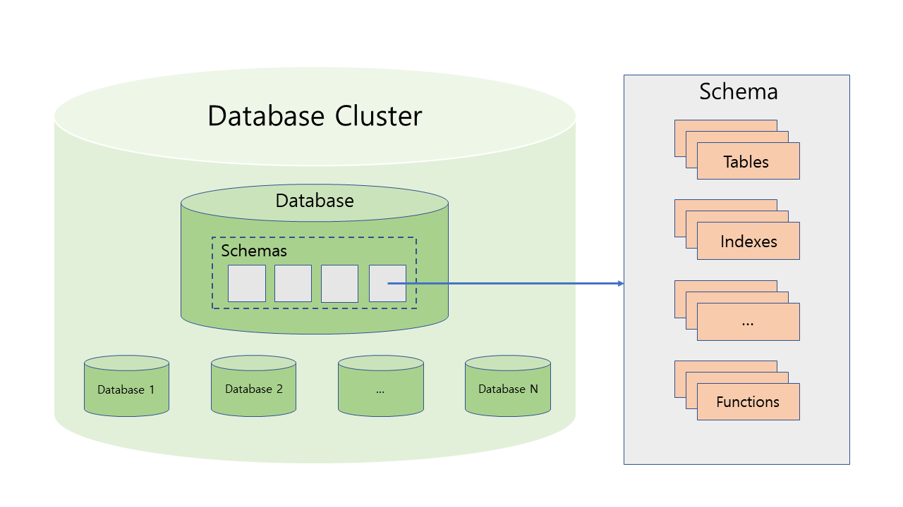

# Chapter 1. Data Layout
1장에서는 PostgreSQL이 data를 어떤 구조로 관리하는지 간략하게 살펴보겠습니다. Data가 논리적인 level에서 어떻게 관리되고 있고, 그리고 그것들이 OS level에서 어떻게 mapping 되는지 살펴봅니다. 조금 더 나아가 data가 저장되는 기본 단위인 block에 대해 소개하고 block에 대한 read/write가 어떤 방식으로 처리되는지 살펴봅니다. 

Home 화면에서도 언급했지만 해당 요약은 Hironobu Suzuki의 blog "The Internals of PostgreSQL"를 기반으로 작성된 내용인 점을 다시 한번 말씀드립니다.

---
## 1.0. TL;DR :shrug:
1장 내용 요약!
<ul style="list-style-type: none">
  <li>
  <details>
    <summary> Database는 database object들의 collection이다. </summary> 
    <ul>
      <li> Database 자체도 database object이며 object id를 발급받는다.</li>
      <li> 하나의 PG server instance에서 여러 개의 database를 가질 수 있다. </li>
      <li> Database의 묶음을 database cluster라고 부른다. </li>
    </ul>
  </details>
  </li>
  <li>
  <details>
    <summary>OS level에서 database cluster는 directory다. Database는 database cluster의 subdirectory이며 directory명은 database의 object id다.</summary>
    <ul>
      <li> $PGDATA 환경변수로 지정된 path에 DBMS 운영에 필요한 다양한 파일들이 저장된다.</li>
      <li> Database cluster는 $PGDATA/base directory다.</li>
      <li> Object id가 12345인 database는 $PGDATA/base/12345 directory다.</li>
    </ul>
  </details>
  </li>
  <li>
  <details>
    <summary>Database에서 생성되는 table, index와 같은 object는 database directory 안에 file로서 저장된다.</summary>
    <ul>
      <li> Object가 처음 생성되었을 때 file명은 object id와 같지만 이후 달라질 수 있다. File명은 pg_class system table에 refilenode 컬럼으로 저장된다.</li>
      <li> File 하나의 크기는 최대 1G이고, 사이즈가 최댓값을 넘어가면 동일 이름에 numbering을 하여 file을 분리해 저장한다.</li>
      <li> 동일 이름의 파일에 '_fsm', '_vm' suffix가 붙는 파일들도 생성되는데 이들은 다른 chapter에서 설명될 예정.</li>
    </ul>  
  </details>
  </li>
  <li>
  <details>
    <summary>PostgreSQL에서의 tablespace는 DB cluster directory 외부의 directory다.</summary>
    <ul>
      <li> 물리적으로는 tablespace가 만들어진 database directory 안에 tablespace의 object id로 symbolic link가 생성되고 지정된 외부 directory를 가르키게 된다.</li>
      <li> Table 생성 시 tablespace를 지정하여 생성할 경우 table의 file이 외부 directory에 저장된다.</li>
    </ul>
  </details>
  </li>
  <li>
  <details>
    <summary>Table file은 block 단위로 append가 되고, block의 default size는 8KB다.</summary>
    <ul>
    <li> Block은 header(24 bytes), line pointer array, tuples로 구성되어 있다. </li>
    <li> Header에는 block에 대한 metadata와 freespace에 대한 정보가 적혀있다. </li>
    <li> Line pointer는 tuple의 위치와 길이 정보를 가지고 있는 4 byte 짜리 구조체이고, header 이후로 array 형태로 append 된다. </li>
    <li> Tuple은 실제 data가 담겨있고 block의 뒤에서부터 append 된다. </li>
    <li> Table을 sequential scan으로 읽을 때는 table file에 있는 block을 차례로 읽으며 line pointers로 dereferencing을 하며 tuple을 읽는다. </li>
    <li> Table을 index scan으로 읽을 때는 index tuple에 달려있는 tuple id(TID)를 보고 block과 tuple index를 받아 마찬가지로 line pointer를 통해 tuple을 읽는다. </li>
    </ul> 
  </details>
  </li>
</ul>

---
## 1.1. Logical View of Data Layout :nerd_face:
### 1.1.1. Database Cluster
Top-down approach로 가보겠습니다. 최상위 level에서는 database cluster가 있습니다. Database cluster는 database community에서 흔히 말하는 여러 개의 database instance를 연결하여 하나의 system처럼 동작하게 하는 clustering 기법이 아니라, 단순히 database의 묶음을 통칭하며 하나의 PostgreSQL server가 hosting하고 관리하는 대상입니다. 

### 1.1.2. Database
그 다음 level에는 database가 있습니다. Database는 table, index, sequence, view, function과 같이 database object들의 묶음을 뜻합니다. Database object에 대한 meta 정보(예를 들어 이름, 식별자, 객체 type 등등)는 자체 생성되는 table에 저장되는데, 그런 table을 system catalogs라고 부릅니다. System catalogs는 database-specific 합니다. 즉, 서로 다른 database는 각자의 system catalogs를 들고 있으며 role이나 몇 개의 object type을 제외하고는 집합론적인 관점에서 서로 배타적 관계라고 볼 수 있습니다. 예를 들어 서로 다른 database에 속해있는 table은 join되거나 하나의 query에서 동시에 조회될 수 없습니다(물론, FDW를 사용한다면 가능합니다만...이 부분은 4장에서 소개드리겠습니다). 

### 1.1.3. Schema
Database 아래에는 schema가 있습니다. 다른 RDBMS에서와 같이 PostgreSQL에서도 schema는 database 내 object들을 논리적으로 묶는 일종의 namespace 역할을 합니다. 비슷한 유형의 data를 묶거나 또는 권한 layer를 설정하는데 사용되고는 합니다(예를 들어 column-level user restriction을 주고 싶다면 특정 column들만 조회하는 view를 생성하여 하나의 schema로 묶어 user permission을 주면 됩니다). Schema는 일종의 namespace 역할을 하기 때문에 같은 database에 있더라도 서로 다른 schema에는 같은 이름의 object를 생성할 수 있습니다.

### 1.1.4. Tablespace
마지막으로 PostgreSQL의 tablespace에 대해서 소개드리겠습니다. Tablespace는 CREATE TABLESPACE 문을 통해 생성되며 base directory 외부에 있는 target directory에 table이나 index를 저장할 때 사용됩니다. 

<details>
  <summary><font size="3">Picture of data layout</font></summary>
  
  
</details>

---
## 1.2. System View of Data Layout :floppy_disk:
### 1.2.1. Database Cluster
다시 한번 database cluster에서부터 시작하겠습니다. Database cluster는 하나의 directory로 mapping되며 그 directory를 base directory라고 부릅니다. PostgreSQL이 제공하는 initdb utility를 사용하여 database cluter를 생성할 때 DATADIR라는 변수명으로 directory path를 인자로 주는데, 해당 directory가 base directory가 됩니다. 주로 base directory는 PGDATA 환경변수에 저장됩니다. 
- <details>
  <summary>Console example</summary>
  
  ```bash
  root@postgres11:/# initdb --help
  initdb initializes a PostgreSQL database cluster.

  Usage:
    initdb [OPTION]... [DATADIR]

  Options:
    -A, --auth=METHOD         default authentication method for local connections
        --auth-host=METHOD    default authentication method for local TCP/IP connections
        --auth-local=METHOD   default authentication method for local-socket connections
  [-D, --pgdata=]DATADIR     location for this database cluster
  ...
  root@postgres11:/# echo $PGDATA
  /var/lib/postgresql/data
  ```    
  </details>

Base directory에는 다양한 file과 subdirectory가 생성됩니다. 아래는 base directory에 생성되는 file과 subdirectory에 대한 설명입니다.
- <details>
    <summary> Files in base directory </summary>
    
    |Files|설명|
    |:---|:---|
    |PG_VERSION|PostgreSQL의 major version number가 들어있는 file|
    |pg_hba.conf|Client 인증정보를 제어하는 file|
    |pg_ident.conf|OS user와 PostgreSQL user의 mapping 정보를 제어하는 file|
    |postgresql.conf|PostgreSQL 설정 parameter를 저장하는 file|
    |postgresql.auto.conf|ALTER SYSTEM 문으로 설정되는 parameter를 저장하는 file|
    |postmaster.opts|PostgreSQL server가 기동된 command line을 기록하는 file|
  </details>
- <details>
    <summary> Subdirectories in base directory </summary>
    
    |Subdirectory|설명|
    |:---|:---|
    |base/|Database subdirectory가 들어있는 subdirectory|
    |global/|pg_database나 pg_control 같은 cluster-wide table이 들어있는 subdirectory|
    |pg_commit_ts/|Transaction commit timestamp data가 들어있는 subdirectory|
    |pg_dynshmem/|Dynamic shared memory subsystem이 사용한 file을 저장하는 subdirectory|
    |pg_logical|Logical decoding을 위한 상태 정보를 담는 subdirectory|
    |pg_multixact|Multitransaction의 상태 정보를 담는 subdirectory|
    |pg_notify|LISTEN/NOTIFY 상태 정보를 담는 subdirectory|
    |pg_repslot|Replication slot data를 담는 subdirectory|
    |pg_serial|Commit된 serializable transaction 정보를 담는 subdirectory|
    |pg_snapshots|pg_export_snapshot 함수를 통해 export된 snapshot을 저장하는 subdirectory|
    |pg_stat|Statistics collector process가 영구 저장하는 file을 담는 subdirectory|
    |pg_stat_tmp|Statistics collector process가 임시 저장하는 file을 담는 subdirectory|
    |pg_subtrans|Subtransaction 상태 정보를 담는 subdirectory|
    |pg_tblspc|Tablespace에 대한 symbolic link를 담는 subdirectory|
    |pg_twophase|Prepared transaction의 상태 정보를 담는 subdirectory|
    |pg_wal|WAL segment file을 저장하는 subdirectory|
    |pg_xact|Transaction의 commit 상태 정보를 담는 subdirectory|
  </details>

### 1.2.2. Database and Objects
Database는 자신의 object id를 이름으로 갖는 subdirectory로 mapping 되며 $PGDATA/base subdirectory 안에 위치하게 됩니다. Table과 index는 속해있는 database의 subdirectory에 file로 저장되며 마찬가지로 처음에는 object id를 이름으로 갖게 됩니다. 하지만 table truncate나 reindex가 발생하는 경우 file 이름이 처음에 발급된 이름과 다른 것으로 생성되게 됩니다. 
- <details>
    <summary> Console example </summary>
    
    ```sql
    postgres=# create table tibero (c1 char);
    CREATE TABLE
    postgres=# select relname, oid, relfilenode from pg_class where relname = 'tibero';
    relname |  oid  | relfilenode 
    ---------+-------+-------------
    tibero  | 24576 |       24576
    (1 row)
    ```
    ```bash
    root@postgres11:/var/lib/postgresql# ll $PGDATA/base/13067/24576
    -rw------- 1 postgres postgres 0 May 23 04:55 /var/lib/postgresql/data/base/13067/24576
    ```
    ```sql
    postgres=# truncate table tibero;
    TRUNCATE TABLE
    postgres=# select relname, oid, relfilenode from pg_class where relname = 'tibero';
    relname |  oid  | relfilenode 
    ---------+-------+-------------
    tibero  | 24576 |       24579
    (1 row)
    ```
    ```bash
    root@postgres11:/var/lib/postgresql# ll $PGDATA/base/13067/24576
    -rw------- 1 postgres postgres 0 May 23 04:56 /var/lib/postgresql/data/base/13067/24576
    root@postgres11:/var/lib/postgresql# ll $PGDATA/base/13067/24579
    -rw------- 1 postgres postgres 0 May 23 04:56 /var/lib/postgresql/data/base/13067/24579
    시간이 조금 흐른뒤
    root@postgres11:/var/lib/postgresql# ll $PGDATA/base/13067/24576
    ls: cannot access '/var/lib/postgresql/data/base/13067/24576': No such file or directory
    ```
  </details>

Truncate가 발생한 직후에 기존 파일이 바로 지워지지는 않는 것을 확인할 수 있습니다. 반면 PostgreSQL 공식 문서에서는 바로 OS에 disk 공간을 반납한다고 적혀 있습니다.
<pre>
<a href="https://www.postgresql.org/docs/current/sql-truncate.html">PostgreSQL documents 참조</a>
Furthermore, it reclaims disk space immediately, rather than requiring a subsequent VACUUM operation. 
</pre>
그런 점으로 보아 내부 background process에서 해당 file의 descriptor를 열어놓고 있다가 어떤 작업을 진행한 후 delete를 해서 그런 것이 아닌가 생각이 듭니다. 이 부분에 대해서는 추가적으로 조사가 필요해 보이는군요.

### 1.2.3. Tablespace
Tablespace는 base directory의 pg_tblspc subdirectory에 symbolic link로 저장됩니다. Tablespace를 생성하면 pg_tblspc subdirectory에 object id를 이름으로 DDL문에서 지정한 target directory를 가리키는 symbolic link가 저장이 됩니다. Tablespace의 target directory로 들어가보면 PostgreSQL version-specific한 이름으로 subdirectory가 생성된 것을 볼 수 있습니다. 해당 subdirectory의 naming 규칙은 PG_'Major version'_'Catalogue version number'로 되어 있습니다. 이제 생성된 tablespace에 table을 생성하게 되면 일단 해당 table이 속해있는 database의 object id로 tablespace subdirectory 안에 subdirectory가 생성이 되고, 생성한 table의 table file이 그 안에 생성됩니다.
- <details>
    <summary> Console example </summary>

    ```sql
    sampledb=# CREATE TABLE newtbl (.....) TABLESPACE new_tblspc;

    sampledb=# SELECT pg_relation_filepath('newtbl');
                pg_relation_filepath             
    ---------------------------------------------
    pg_tblspc/16386/PG_14_202011044/16384/18894
    ```
  </details>

<details>
  <summary><font size="3">Picture of data layout in OS level</font></summary>
 
  
</details>

<details>
  <summary><font size="3">Picture of tablespace in OS level</font></summary>
  
  
</details>

---
## 1.3. Internal Structure of Table File :page_with_curl:
PostgreSQL은 data를 file에 저장할 때 고정 크기의 block으로 나눠 저장합니다. Block의 default 크기는 8KB이며 server를 compile할 때 configure script의 parameter로 최대 32KB까지 크기를 변경할 수 있습니다 (run-time configure는 제공되지 않습니다). 예를 들어, CREATE TABLE 문을 통해 table을 생성하면 size가 0 byte인 table file이 생성됩니다. 그 후 8KB 이하 크기의 data를 table에 적재하면 table file의 크기는 8KB로 증가하게 됩니다. 이 후 8KB 배수의 크기를 넘겨 data를 적재할 때마다 table file의 크기는 8KB 씩 증가하게 되는 방식입니다. Table file를 구성하는 block에는 3개의 부분으로 분리됩니다.
- Block Header: PageHeaderData 구조체가 table file buffer 시작 위치에 할당되며 size는 24 bytes 입니다. Block에 대한 일반적인 정보가 저장되고, 특히 pd_lower, pd_upper 변수를 통해 가용 공간에 대한 관리를 합니다.
  - <details>
      <summary>PageHeaderData</summary>

      ```C
      /* @src/include/storage/bufpage.h */
      typedef struct PageHeaderData
      {
        /* XXX LSN is member of *any* block, not only page-organized ones */
        PageXLogRecPtr pd_lsn;       /* LSN: next byte after last byte of xlog
                                      * record for last change to this page */
        uint16         pd_checksum;  /* checksum */
        uint16         pd_flags;     /* flag bits, see below */
        LocationIndex  pd_lower;     /* offset to start of free space */
        LocationIndex  pd_upper;     /* offset to end of free space */
        LocationIndex  pd_special;   /* offset to start of special space */
        uint16         pd_pagesize_version;
        TransactionId  pd_prune_xid; /* oldest prunable XID, or zero if none */
        ItemIdData     pd_linp[FLEXIBLE_ARRAY_MEMBER]; /* line pointer array */
      } PageHeaderData;
      ```
    </details>
- Line Pointer Array: Block header 다음 위치에 할당되며 block에 tuple을 추가할 때마다 tuple의 위치 offset과 길이를 담은 line pointer가 append 됩니다. Line pointer의 크기는 4 byte이며 ItemIdData 객체로 표현됩니다.
  - <details>
    <summary>ItemIdData</summary>
  
    ```C
    /* @src/include/storage/itemid.h */
    typedef struct ItemIdData
    {
      unsigned  lp_off:15,    /* offset to tuple (from start of page) */
                lp_flags:2,   /* state of line pointer, see below */
                lp_len:15;    /* byte length of tuple */
    } ItemIdData;

    /*
     * lp_flags has these possible states.  An UNUSED line pointer is available
     * for immediate re-use, the other states are not.
     */
    #define LP_UNUSED   0   /* unused (should always have lp_len=0) */
    #define LP_NORMAL   1   /* used (should always have lp_len>0) */
    #define LP_REDIRECT 2   /* HOT redirect (should have lp_len=0) */
    #define LP_DEAD     3   /* dead, may or may not have storage */
    ```
  </details>
- Tuples: 실제 record data를 담고 있으며 block의 끝지점부터 역방향으로 할당됩니다. Tuple 내부에는 실제 record data 뿐만 아니라 concurrency control을 위한 meta 정보도 같이 저장됩니다. Tuple의 meta 정보에 대해서는 다음 장에서 소개하겠습니다. 
<details>
  <summary><font size="3">Picture of table file layout</font></summary>
  
  
</details>

---
## 1.4. Read and Write Table File :memo:
### 1.4.1. Write Table File
Table file을 쓸 때는 우선 block header에 적힌 freespace에 대한 정보를 읽어야 합니다. Block header에는 pd_lower와 pd_upper 변수가 있는데 각각 마지막 line pointer의 끝부분 위치와 마지막 tuple이 append된 앞부분 위치를 offset 형태로 들고 있습니다. 이 때 append 할 새로운 tuple이 들어오면 우선 해당 tuple의 크기가 freespace 보다 큰 경우 새로운 block을 받아 append를 하고, 크기가 freespace 보다 작은 경우 pd_upper offset 위치에서부터 tuple의 length 만큼을 앞당긴 위치에 tuple을 append 합니다. 그리고 새롭게 append된 tuple의 offset을 pd_lower 위치에 line pointer를 추가하여 기록해줍니다.

Suzuki의 블로그에선 생략되었고 추가적으로 코드를 살펴봐야겠지만 tuple을 append 할 때 word size에 맞춰 alignment를 고려하지 않을 수 없을 것입니다. Alignment를 무시하고 append를 하게 되면 CPU가 tuple을 읽어올 때 미정의 동작이 발생하거나 불필요한 reads가 발생하기 때문입니다. 이는 tuple 뿐만 아니라 tuple 안에 있는 attribute도 마찬가지입니다. Tuple의 경우에는 단순히 alignment에 맞춰 시작점을 잡고 line pointer에 기록해두면 문제가 없지만, attribute의 경우에는 padding을 넣거나 attribute의 순서를 변경하여 alignment를 맞춰졌을 것 같습니다. PostgreSQL은 어떻게 alignment 문제를 해결했는지 코드로 확인해봐야 할 것 같습니다. :thinking:

<details>
  <summary><font size="3">Picture of table file write</font></summary>
  
  
</details>

### 1.4.2. Read Table File
Table file을 읽는 방법은 크게 두 가지로 나눠질 수 있습니다. 첫 번째는 전체 table을 순차적으로 읽는 sequential scan입니다. Sequential scan으로 읽을 때는 pg_class table의 relfilenode 컬럼에 기입된 값을 사용하여 읽어야 하는 file을 찾고, file 안에 있는 block을 차례로 읽습니다. Block 안에서는 시작점에서부터 block header 크기만큼 offset을 건너뛰어 line pointer array를 찾고, line pointer들을 하나씩 읽으며 실제 tuple의 위치로 derefencing 합니다. Line pointer array를 모두 iterating하면 다음 block으로 넘어가 같은 방법으로 모든 block에 대해 처리가 끝날 때까지 sequential read를 진행하게 됩니다.

Table을 읽는 두 번째 방법은 index를 통해 원하는 tuple에 찾아가는 index scan입니다. Index를 따라가 원하는 index tuple에 도착하면 해당 tuple에는 실제 tuple이 위치한 곳을 알려주는 tuple id(TID)가 존재합니다. TID에는 block index와 tuple index가 있는데, table file 안에서 tuple이 몇 번째 block에 있는지, block 안에 몇 번째 line pointer가 해당 tuple의 offset 정보를 가지고 있는지를 TID를 통해서 알 수 있게 됩니다. TID를 통해 얻게된 정보로 알맞을 line pointer에 접근하고 다시 한번 원하는 tuple에 dereferencing 하여 tuple을 읽게 됩니다.

<details>
  <summary><font size="3">Picture of table file read</font></summary>
  
  
</details>

